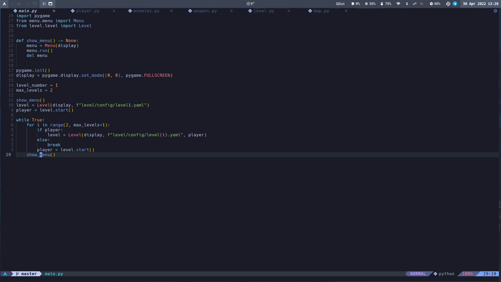
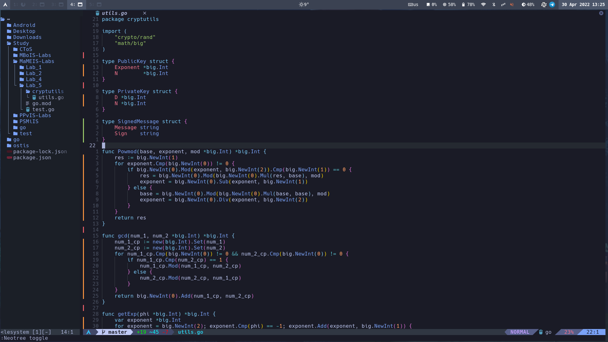
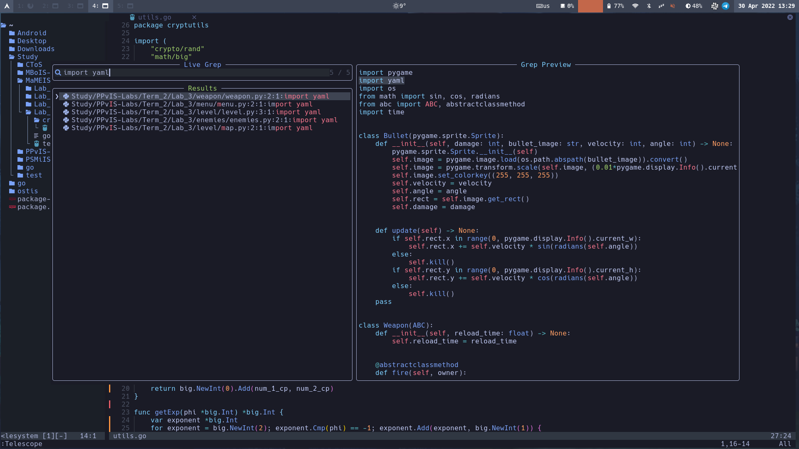

## About

This repo is my neovim configuration based on [AstroNvim](https://github.com/AstroNvim/AstroNvim) project.


##  Preview






##  Features
    
It provides all basic features of basic [AstroNvim](https://github.com/AstroNvim/AstroNvim) except following:
- Dashboard
- Which-key

Additionally you can find here:
- [markdown-preview](https://github.com/iamcco/markdown-preview.nvim)
- [ostis-syntax](https://github.com/PlagaMedicum/ostis-syntax.vim)

##  Requirements

- [AstroNvim](https://github.com/AstroNvim/AstroNvim)
- [NodeJS](https://nodejs.org/en/)
- [Yarn](https://yarnpkg.com/)


##  Installation

To install configuration you should only clone this repo to `lua/user` folder in AstroNvim config (default: `~/.config/nvim`).

```shell
git clone https://github.com/VasKho/nvim-config ~/.config/nvim/lua/user
```


##  Basic Setup

###  Install LSP

Enter `:LspInstall` followed by the name of the server you want to install

Example: `:LspInstall pyright`


###  Install language parser

Enter `:TSInstall` followed by the name of the language you want to install

Example: `:TSInstall python`


###  Manage plugins

Run `:PackerClean` to remove any disabled or unused plugins

Run `:PackerSync` to update and clean plugins


###  Default mappings

| Shortcut  | Function        |
|:---------:|:---------------:|
| `Space+w` | Toggle terminal |
| `Space+e` | Toggle Neotree  |
| `Space+t` | Open Telescope  |
| `Space+s` | Live grep       |
| `Space+f` | Live find       |
| `gD`      | Go to declaration of current symbol |
| `gd`      | Show the definition of current symbol |
| `gI`      | Go to implementation of current symbol |
| `Space+/` | Toggle comment line |
| `md`      | Toggle markdown preview in browser |
